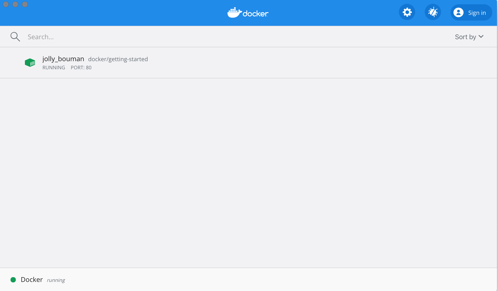

## Getting Started

#### The command you just ran

```
dokcer run -d -p 80:80 docker/getting-started
```

You'll notice a few flags being used. Here's some more info on them:

- ``` -d ``` - run the container in detached mode (in the background)
- ``` -p 80:80``` - map prot 80 of the host to port 80 in the container
- docker/getting-started - the image to use

> Pro tip
>
> You can combines single character flags to shorten the full command. As an example, the command above could be written as:
>
> ``` docker run -dp 80:80 docker/getting-started```

#### The Docker Dashboard

Docker Dashboard, which gives you quick view of the containers running on your machine. It gives you quick access to container logs, lets you get a sheel inside the container, and lets you easily manage container lifecycle (stop, remove, etc.).

To access the dashboard, follow the instructions for either [Mac](https://docs.docker.com/docker-for-mac/dashboard/) or [Windows](https://docs.docker.com/docker-for-windows/dashboard/). If you open the dashboard now, you will see this tutorial running! The container name( jolly_bouman below) is a randomly created name. So, you'll most likely hae a different name.




